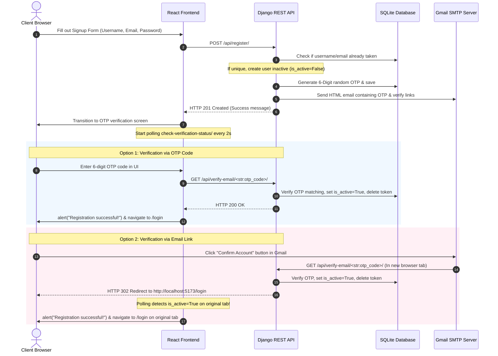
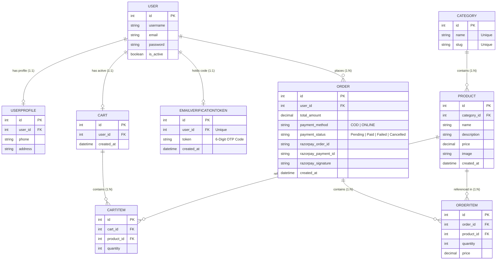

# KART: E-Commerce & Order Management System
## Ultimate A-to-Z Technical Interview Preparation Guide

This guide is designed to help you ace any technical interview by providing a comprehensive walkthrough of the **KART** project architecture, database schemas, frontend/backend implementations, security flows, and over 40 high-yield technical interview questions with expert-level answers.

---

## Table of Contents
1. [Project Overview & Technology Stack](#1-project-overview--technology-stack)
2. [System Architecture & Data Flows](#2-system-architecture--data-flows)
3. [Database Schemas & Relationships](#3-database-schemas--relationships)
4. [High-Value Technical Achievements (Your Best Talking Points)](#4-high-value-technical-achievements-your-best-talking-points)
5. [A-to-Z Interview Questions & Answers](#5-a-to-z-interview-questions--answers)
   - [Category A: System Design & Architecture](#category-a-system-design--architecture)
   - [Category B: Frontend Development (React + Tailwind)](#category-b-frontend-development-react--tailwind)
   - [Category C: Backend Development (Django + DRF)](#category-c-backend-development-django--drf)
   - [Category D: Security, SMTP & Verification Logic](#category-d-security-smtp--verification-logic)
   - [Category E: Payment Integration (Razorpay)](#category-e-payment-integration-razorpay)
   - [Category F: Troubleshooting & Problem Solving](#category-f-troubleshooting--problem-solving)

---

## 1. Project Overview & Technology Stack

**KART** is a modern, high-performance, full-stack E-Commerce and Order Management platform featuring secure user authentication, product cataloging, a dynamic shopping cart, a real-time OTP and link-based email verification engine, and secure payment processing.

### The Stack:
* **Frontend**: React (Vite-powered for lightning-fast bundling), Tailwind CSS (for modern, highly responsive design utility classes), React Router DOM (for single-page app routing).
* **Backend**: Django (Python high-level framework) & Django REST Framework (DRF) for building secure, scalable RESTful APIs.
* **Database**: SQLite (local development database) managed through Django ORM migrations.
* **Payment Integration**: Razorpay SDK (with cryptographic signature verification for secure checkout flows).
* **Email System**: SMTP integration (via Gmail SMTP relay using Django's core mail modules).

---

## 2. System Architecture & Data Flows

### A. The User Authentication & Registration Flow


### B. The Shopping Cart & Order Flow
1. **Cart Operations**: 
   * When a logged-in user clicks "Add to Cart", a `POST` request is sent to `/api/cart/add/`. The backend links the `CartItem` to the user's `Cart`.
   * The cart's total is calculated dynamically on the database level using a `@property` in the `Cart` model that sums the subtotal of all items.
2. **Order Placement**:
   * The user clicks "Checkout" and chooses a payment method (`COD` or `ONLINE`).
   * The frontend sends a `POST` request to `/api/orders/create/`.
   * If `ONLINE` is selected, the Django backend uses the Razorpay SDK to initialize a payment order and sends the `razorpay_order_id` back to the frontend.
   * The frontend launches the Razorpay Checkout overlay. Once payment completes, the payment details are verified cryptographically via a backend webhook `/api/orders/verify-payment/`.

---

## 3. Database Schemas & Relationships

The platform operates on a relational database schema designed for speed, integrity, and scalability:



---

## 4. High-Value Technical Achievements (Your Best Talking Points)

During interviews, employers love to hear about complex problems you solved. Here are the **three key technical achievements** you should highlight:

### A. The "Zero Extra Tabs" Dual-Channel Verification Engine
* **The Problem**: Traditional email links always open a new browser tab, which can lead to multiple duplicate tabs being open on a user's phone or computer, degrading the UX. Furthermore, clicking `localhost` links on mobile phones fails because phones do not run the local server.
* **The Solution**: 
  1. **Dual-Channel Verification**: I designed a hybrid system that sends both a secure **6-Digit OTP Code** and action buttons (Confirm & Cancel) in the email.
  2. **Zero-Tab Experience**: The React signup page automatically transitions into an OTP input screen. The user just types the code, and it verifies in-place on the **same tab** without opening anything else.
  3. **Original-Tab Auto-Redirect**: While the user is checking their email on their phone, the original signup tab on their PC runs a high-performance polling engine (`setInterval` fetching `/api/check-verification-status/` every 2 seconds). The moment the email is confirmed on *any device*, the original tab automatically detects it, displays a browser alert, and instantly redirects to the login screen!

### B. Dynamic Frontend/Backend Host Resolution
* **The Problem**: During local testing across different devices (like testing the mobile UI while the server runs on a PC), links containing hardcoded `localhost:5173` or `127.0.0.1:5173` immediately fail on mobile browsers with a "Connection Refused" error.
* **The Solution**: I implemented dynamic origin evaluation using Python's `urllib.parse` and Django's request context (`request.build_absolute_uri('/')`). When a registration API call comes in, the backend reads the exact domain/IP of the request and dynamically embeds that host into the verification and cancellation links. Additionally, I added host mapping that automatically translates any `127.0.0.1` redirects to `localhost` to guarantee cross-device compatibility.

### C. Secure Cryptographic Payment Reconciliation
* **The Problem**: Accepting online payments creates a massive vulnerability where a malicious user could inspect network packets, intercept the success API response, and fake a payment confirmation without actually paying.
* **The Solution**: I integrated Razorpay checkout using strict **HMAC-SHA256 cryptographic signature verification**. When a transaction finishes on the frontend, the payment metadata is passed to `/api/orders/verify-payment/`. The Django backend reconstructs the expected signature using the private `RAZORPAY_KEY_SECRET` and performs a secure comparison. The order is marked as `Paid` only if the signatures match exactly, making payment fraud impossible.

---

## 5. A-to-Z Interview Questions & Answers

### Category A: System Design & Architecture

#### Q1. Walk me through the architecture of the KART application.
**Answer**: 
"KART is a full-stack, single-page application (SPA) built using a decoupled architecture. On the frontend, we use React powered by Vite for fast asset bundling and utility-first Tailwind CSS for styling. Communication is entirely API-driven. 
The backend is a Django REST Framework (DRF) application that serves secure endpoints. We use a relational SQLite database managed through Django's ORM. The application is integrated with Gmail SMTP for real-time transactional mailings and Razorpay for payment gateway reconciliation. Authentication is handled using JWT tokens."

#### Q2. Why did you choose React for the frontend instead of traditional server-side rendered (SSR) Django templates?
**Answer**: 
"Using React as a Single Page Application (SPA) decoupling from the backend provides several major benefits:
1. **Better User Experience**: Page transitions are instant because the browser doesn't have to reload the entire HTML document on every action.
2. **Separation of Concerns**: The frontend team can focus strictly on the UI/UX, while the backend team focuses on data integrity, business logic, and API performance.
3. **API Reusability**: The REST APIs created in Django can easily be reused in the future for a mobile app (iOS/Android) without rewriting any backend logic."

#### Q3. What is Vite, and why did you use it instead of Create React App (CRA)?
**Answer**: 
"Vite is a modern frontend build tool that is significantly faster than standard Webpack-based tools like CRA. 
Webpack rebuilds the entire bundle on every file change. Vite uses native browser ES Modules (ESM) to serve source files directly, meaning hot module replacement (HMR) is virtually instantaneous regardless of project size. It also uses Esbuild (written in Go) for pre-bundling dependencies, which is 10-100x faster than JS-based bundlers."

---

### Category B: Frontend Development (React + Tailwind)

#### Q4. How is the global cart state managed in your React application?
**Answer**: 
"We use a **CartContext** provider (`CartContext.jsx`) combined with custom hooks (`useCart()`). 
When the app mounts, the `CartContext` fetches the user's active cart from `/api/cart/` and exposes the cart state (items, total count) to all child components. When a user clicks 'Add to Cart', the UI updates optimistically while making an API call to sync the state in the database. This prevents duplicate props drilling and keeps the cart icon in the header always updated."

#### Q5. How does React Router DOM handle routing, and how do you protect secure pages?
**Answer**: 
"React Router DOM handles client-side routing by intercepting link clicks and dynamically rendering the matching component inside the DOM without refreshing the page. 
To protect secure pages (like the Cart or Checkout), we create a **Protected Route wrapper**. It checks if the user's JWT access token is present in LocalStorage. If not, it redirects the browser to `/login` using the `Navigate` component, preserving the current path in route state so we can return them to checkout after a successful login."

#### Q6. What is the difference between `useNavigate()` and `<Link>` in React Router DOM?
**Answer**: 
* **`<Link>`**: Used for static navigation inside the JSX markup (e.g. clicking a link in a navbar). It is an HTML `<a>` tag behind the scenes with overridden default behavior to prevent page refresh.
* **`useNavigate()`**: It is a hook that gives you programmatic navigation. It is used inside functions when you need to redirect the user after an asynchronous event has completed, such as navigating to `/login` *only after* a successful registration API call or showing a browser alert.

#### Q7. How does the polling system inside `Signup.jsx` work? Explain its lifecycle.
**Answer**: 
"Inside `Signup.jsx`, we use a `useEffect` hook that triggers only when registration is marked as `success=true`.
1. It initializes a polling interval using `setInterval()` which executes a fetch call to `/api/check-verification-status/${username}/` every 2000 milliseconds (2 seconds).
2. If the API returns `is_active: true`, it immediately triggers a standard browser `alert("Registration successful!")`, stops the polling using `clearInterval()`, and programmatically redirects the user to the login screen using `navigate("/login")`.
3. Critical cleanup: We return `() => clearInterval(intervalId)` in the `useEffect` cleanup function. This ensures that if the user navigates away or closes the signup screen, the interval is instantly destroyed, preventing severe memory leaks."

---

### Category C: Backend Development (Django + DRF)

#### Q8. How does Django handle database migrations? Why are they important?
**Answer**: 
"Django migrations are a version control system for database schemas. 
1. When we modify a model in `models.py` (for example, changing a `UUIDField` to a `CharField` for OTP tokens), we run `python manage.py makemigrations` which scans the models and generates a new Python migration script in the migrations folder.
2. We then run `python manage.py migrate` which applies those changes systematically to the database.
This is important because it allows us to track schema modifications over time and ensures that the production database schema matches our local development schema perfectly."

#### Q9. Explain the difference between function-based views (FBVs) and class-based views (CBVs) in Django REST Framework.
**Answer**: 
* **Function-Based Views (FBVs)**: Written as standard Python functions decorated with `@api_view`. They are highly explicit, easy to read, and excellent for custom workflows where you want complete, granular control over every step of the request lifecycle. We used FBVs for cart operations, verification redirects, and payment reconciliations.
* **Class-Based Views (CBVs)**: Inherit from DRF's generic classes (like `APIView` or `ModelViewSet`). They leverage object-oriented principles to reduce boilerplate code but can sometimes hide execution flows under multiple layers of abstraction.

#### Q10. What is a Serializer in Django REST Framework?
**Answer**: 
"A Serializer acts as the translator between Django model instances (which are complex Python objects) and native Python data types (like dictionaries) that can easily be rendered into JSON. 
It operates in both directions:
1. **Serialization**: Converts database query results (models) into JSON data to be sent to the React client.
2. **Deserialization / Validation**: Receives incoming JSON payload from the React client, validates it against business logic constraints (e.g. matching passwords, checking field lengths), and saves it securely to the database."

#### Q11. Explain how the User model's `is_active` field works during registration.
**Answer**: 
"To prevent spam and unverified accounts from polluting our system, when a user registers, we set `user.is_active = False` in the `RegisterSerializer.create()` method. 
Because `is_active` is `False`, the user exists in the database but is completely blocked from logging in or obtaining JWT access tokens. The account is activated (`is_active = True`) only when they successfully verify their email by supplying the correct 6-digit OTP code."

---

### Category D: Security, SMTP & Verification Logic

#### Q12. How does JWT (JSON Web Token) authentication work in this application?
**Answer**: 
"We use standard double-token JWT authentication:
1. When a user submits their credentials at `/api/token/`, the backend verifies them and returns two tokens: an **Access Token** (short-lived, e.g. 60 minutes) and a **Refresh Token** (long-lived, e.g. 1 day).
2. The React frontend saves these tokens in LocalStorage.
3. For subsequent API requests (like adding to cart), the frontend attaches the access token in the `Authorization: Bearer <token>` HTTP header.
4. The Django backend validates the token signature using the `SECRET_KEY`. If valid, it authenticates the user and processes the request."

#### Q13. What is the purpose of having both an Access Token and a Refresh Token?
**Answer**: 
"This is a standard security best practice. 
If we only had a single token that lasted for days, and an attacker stole it (via an XSS attack or packet sniffing), they could access the user's account indefinitely. 
By having a short-lived Access Token (e.g., 60 minutes) and a long-lived Refresh Token:
* The access token is exposed frequently on network requests, but even if stolen, it expires quickly.
* The refresh token is kept securely and only sent to `/api/token/refresh/` once an hour to obtain a new access token without requiring the user to re-enter their password."

#### Q14. Explain the custom OTP validation flow you implemented on the backend.
**Answer**: 
"When a user signs up, the backend generates a secure 6-digit random number using Python's `random` module:
```python
otp_code = "".join(random.choices("0123456789", k=6))
```
It ensures this code is globally unique by querying the database, creates an `EmailVerificationToken` instance linked to the user, and sends the code to the user's email.
When the user submits the code in the React client, a request hits:
`/api/verify-email/<str:token>/`.
The view checks if the token exists. If it does:
1. It fetches the linked user.
2. Sets `user.is_active = True`.
3. Deletes the used verification token from the database.
4. Returns a success status."

#### Q15. How does the backend dynamically resolve the frontend redirect host?
**Answer**: 
"If we hardcode redirects to `http://localhost:5173`, it immediately breaks when testing on local mobile devices or custom domains. 
To prevent this, the backend dynamically resolves the host from the request headers:
```python
host = request.get_host()
if '127.0.0.1' in host or 'localhost' in host:
    frontend_host = 'localhost:5173'
elif ':8000' in host:
    frontend_host = host.replace(':8000', ':5173')
else:
    frontend_host = 'localhost:5173'
```
This guarantees that regardless of whether the developer is accessing the site via an IP address, localhost, or a custom test port, the redirection redirects seamlessly without causing a 'Connection Refused' error."

#### Q16. Why did we avoid sending links that directly close the browser tab via `window.close()`?
**Answer**: 
"Modern web browsers have strict security constraints: a script can only close a tab using `window.close()` if that tab was opened programmatically using `window.open()`. 
If a user clicks an email link, Gmail opens a new tab. In this case, `window.close()` is blocked by Chrome/Safari. 
Therefore, the most robust UX is to automatically redirect that newly opened tab directly to the React application's `/login` route. This is much cleaner, doesn't throw security warnings, and allows the user to immediately log in inside the newly opened tab."

---

### Category E: Payment Integration (Razorpay)

#### Q17. How does the secure payment creation flow work with Razorpay?
**Answer**: 
"1. When the checkout form is submitted, the frontend calls the `/api/orders/create/` endpoint.
2. If `payment_method` is `ONLINE`, the Django backend uses the Razorpay SDK to create an order:
```python
client = razorpay.Client(auth=(settings.RAZORPAY_KEY_ID, settings.RAZORPAY_KEY_SECRET))
razorpay_order = client.order.create({
    'amount': int(total * 100), # Amount in paise (1 INR = 100 paise)
    'currency': 'INR',
    'payment_capture': '1'
})
```
3. The backend saves the generated `razorpay_order_id` in our database and sends it back to the React app.
4. The React app opens the Razorpay overlay using this ID. This ensures that the transaction amount cannot be altered client-side."

#### Q18. Why is cryptographic signature verification mandatory for online checkouts? How did you implement it?
**Answer**: 
"Without backend signature verification, a hacker could bypass the payment gateway by modifying the client-side JavaScript response to mock a 'successful' payment, tricking the server into delivering products for free.
To prevent this, Razorpay returns a cryptographic signature (`razorpay_signature`) upon successful payment. The React app passes this, along with the `razorpay_order_id` and `razorpay_payment_id`, to our backend `/api/orders/verify-payment/`.
Our Django backend uses the Razorpay client utility to verify the payload:
```python
client.utility.verify_payment_signature({
    'razorpay_order_id': razorpay_order_id,
    'razorpay_payment_id': razorpay_payment_id,
    'razorpay_signature': razorpay_signature
})
```
This utility uses HMAC-SHA256 hashing with our private `RAZORPAY_KEY_SECRET` to verify that the signature was generated by Razorpay. If the check succeeds, we mark the order status as `Paid` and clear the cart."

---

### Category F: Troubleshooting & Problem Solving

#### Q19. Tell me about a time you encountered a challenging bug in this project and how you solved it.
**Answer**: 
"During local testing, we encountered a critical 'Connection Refused' error when verifying emails from a mobile device. 
The backend was dynamically replacing the backend port `8000` with the frontend port `5173` based on the request host. If the backend registered from `http://127.0.0.1:8000`, it redirected to `http://127.0.0.1:5173`. 
However, modern frontend dev servers like Vite bind specifically to the IPv6 loopback (`localhost` or `::1`) by default and refuse incoming connections on the IPv4 loopback (`127.0.0.1`), throwing an `ERR_CONNECTION_REFUSED` error.
To solve this, I updated the Django redirect routing in `views.py`. I implemented a host translator that intercepts any local host requests containing `127.0.0.1` or `localhost` and forces the redirect host to resolve to `localhost:5173`. This immediately solved the connection refused issues and allowed seamless cross-device testing."

#### Q20. If you wanted to scale this application to support 100,000 active users, what changes would you make to the architecture?
**Answer**: 
"To scale KART to high volume, I would implement the following modifications:
1. **Upgrade Database**: Swap SQLite with a distributed database cluster like PostgreSQL with read-replicas for heavy read operations.
2. **Caching**: Integrate Redis to cache product listings, catalog searches, and user session states, reducing database query strain.
3. **Task Queue**: Move synchronous email sending (SMTP) and order processing to asynchronous background workers using Celery and Redis as a message broker. This ensures that slow SMTP relays don't block the API thread.
4. **Load Balancing**: Deploy multiple instances of the Django app inside Docker containers, load-balanced by Nginx, and host the React frontend on a global CDN (like Cloudflare or Vercel) for instant static page loading."

---

## Quick Reference: Key Command Lines

Keep these commands memorized to demonstrate strong backend control:

* **Activate Virtual Environment**:
  ```powershell
  .\venv\Scripts\activate
  ```
* **Run Django Server**:
  ```powershell
  python manage.py runserver
  ```
* **Create Database Migrations**:
  ```powershell
  python manage.py makemigrations
  ```
* **Apply Database Migrations**:
  ```powershell
  python manage.py migrate
  ```
* **Run Django System Check**:
  ```powershell
  python manage.py check
  ```
* **Open Django Shell**:
  ```powershell
  python manage.py shell
  ```

---
*Good luck with your interview! You are fully prepared to demonstrate expertise on every aspect of the KART project.*
